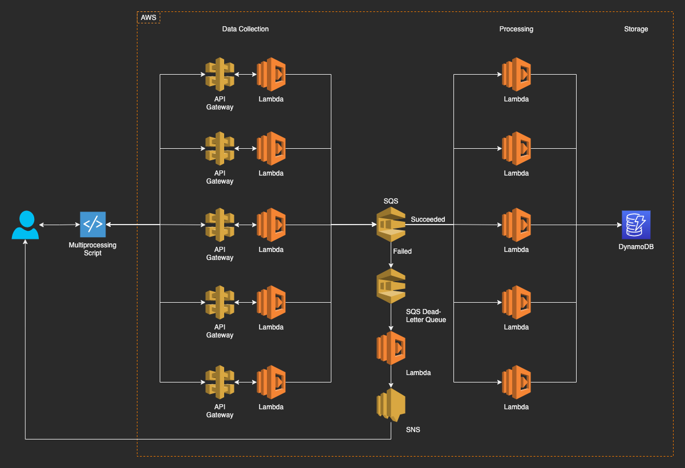

# lambda-distributed

Proof-of-concept experiment for distributed computing using AWS Lambda as data collection and processing nodes.

## TL;DR: How-To

### Deployment Steps

Fastest:

1. Deploy from AWS Serverless Application Repository: [https://serverlessrepo.aws.amazon.com/applications/ap-southeast-1/798471383856/lambda-distributed](https://serverlessrepo.aws.amazon.com/applications/ap-southeast-1/798471383856/lambda-distributed)

(Just) Slightly less fast:

1. (Optional) Update Lambda functions as necessary, and repackage functions and modules as ZIP files.
2. Place ZIP files in an S3 bucket.
3. Deploy CloudFormation templates, filling-in corresponding parameters.
4. Update scripts, supplying API endpoint URLs and API keys from the CloudFormation-provisioned stacks.
4. Run scripts as shown below.

> The single-node infrastructure and script are included for experiment control (comparison) purposes.

### Script Execution

1. BASH: Distributed Processing

    ```bash
    # python3 </path/to/script> <number_of_chunks> </path/to/data/file>
    python3 dist.py 100 mydata.txt 
    ```

2. BASH: Single-Node Processing

    ```bash
    # python3 </path/to/script> </path/to/data/file>
    python3 single.py mydata.txt 
    ```

## Overview

Deploy this infrastructure into your AWS account to create a serverless application that accepts data from the local scripts, process each data point, and send the results to a backend DynamoDB database instance. Modify *lambda_process.py* to change what this does with your data.

### Infrastructure Diagram



### What It Does

Currently, the flow works like the following:

1. Read and validate each data point.
2. Send valid data to an SQS queue.
3. SQS triggers processing Lambda with collected data.
4. Processing Lambda manipulates each datapoint and sends the result to DynamoDB.
5. Each datapoint goes to 1 data collection Lambda and 1 processing Lambda (so sending in 100 chunks of data simultaneously could mean invoking up to 100 Lambda instances).
6. Datapoints failed to be processed after 5 tries will be sent to a dead-letter queue and trigger email notifications to SNS-subscribed addresses.

### How It Reads Data

The scripts read data from text files. The distributed / multiprocessing script does so using Python3's *multiprocessing* module, while the single-node script uses a *for* loop.

1. Distributed execution section

    ```python
    with open(sys.argv[2], 'r') as f:
        data_list = f.readlines()

    p = Pool(int(sys.argv[1]))
    results = p.imap_unordered(
        post,
        data_list
    )
    p.close()
    p.join()
    ```

2. Single-node execution section

    ```python
    with open(sys.argv[1], 'r') as f:
        data_list = f.readlines()

    for data in data_list:
        response = post(data)
    ```

## Infrastructure Concepts

1. Auto-scaling / high-performance / high-availability
2. API-led
3. Loosely-coupled
4. Event-driven
5. Stateless
6. Serverless
7. Encryption at rest (AES 256) and in transit (HTTPS / TLS)

## Source

1. cloudformation
    - infrastructure.yaml - provision resources in an AWS account (charges may apply):
        - API Gateway
        - Lambda
        - Simple Queue Service (SQS)
        - Simple Notification Service (SNS)
        - DynamoDB
    - infrastructure_single.yaml - provision resources for single-node computing (charges may apply):
        - API Gateway
        - Lambda
        - DynamoDB
    - infrastructure_sam.yaml - template for AWS Serverless Application Repository (charges may apply):
        - API Gateway
        - Lambda
        - Simple Queue Service (SQS)
        - Simple Notification Service (SNS)
        - DynamoDB
    > Web Application Firewall (WAF / WebACL) will need to be provisioned separately and optionally attached to the API.

2. python
    - Python3 Lambda functions and modules for API backends.
    - ZIP files contain ready-to-deploy packages of functions and associated modules.

3. scripts
    - Python3 scripts to execute multiprocessing or single-node tasks locally.
    - The scripts will chunk your data and send them to the AWS infrastructure for data collection, processing, and storage.

4. tests
    - Test data. The scripts are written to read the data line-by-line, but you're free to change this according to your needs.
